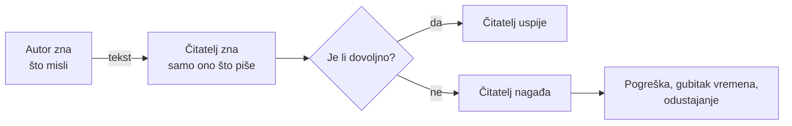
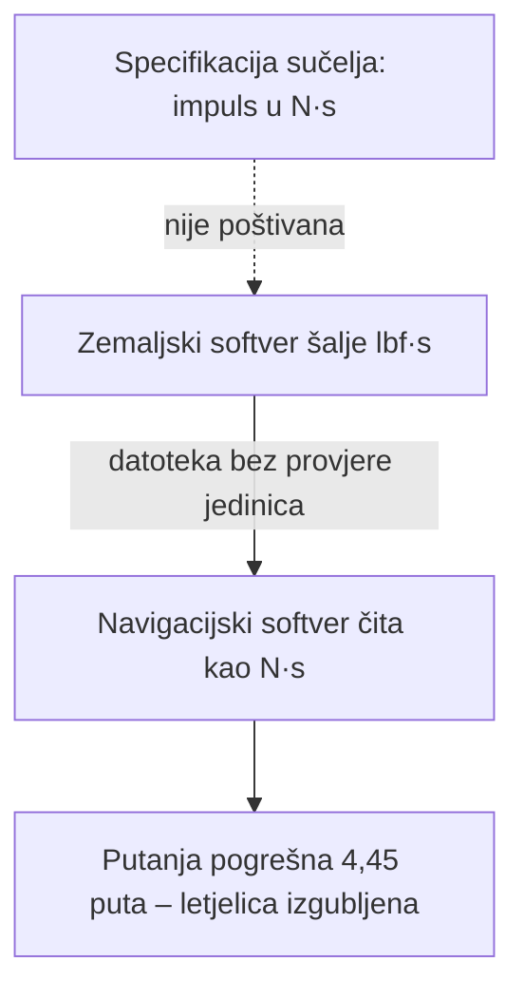
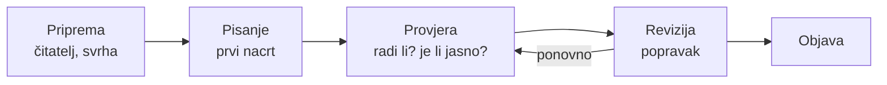
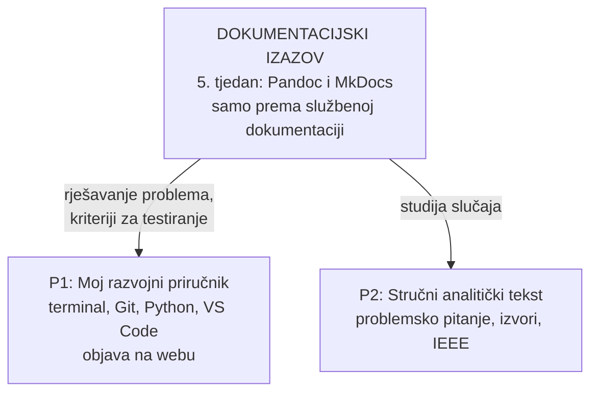
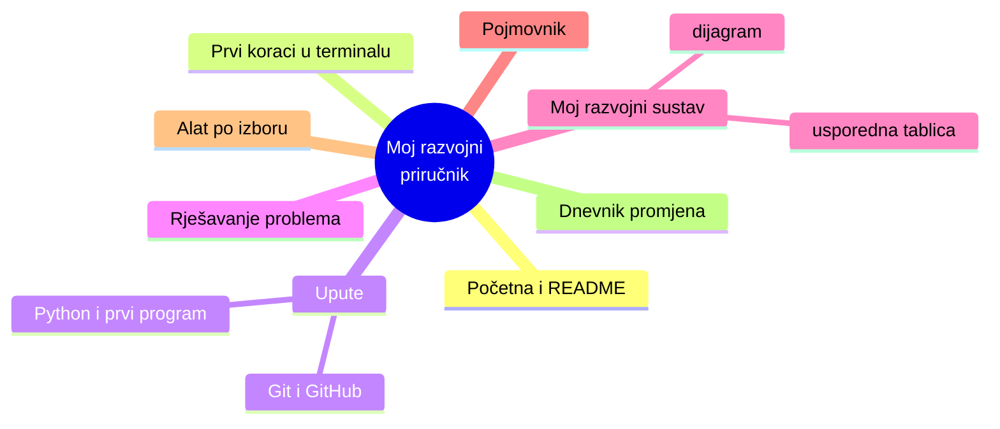
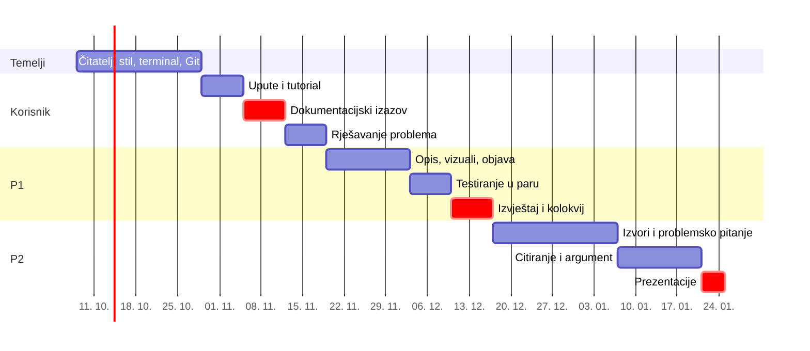
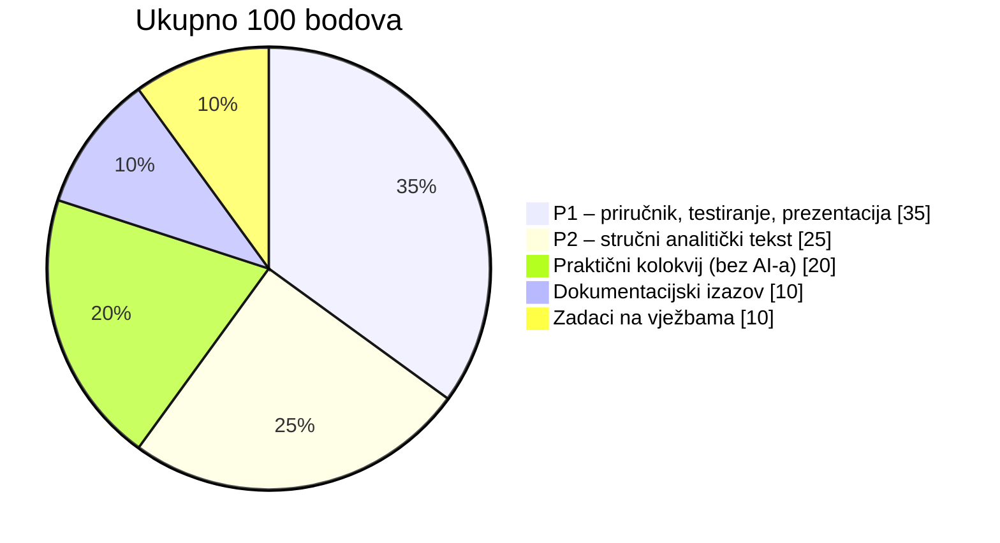

# Prije nego što išta kažem…

## Uzmite papir i olovku

Za dvije minute svi ćete crtati **isti lik**.

Ja ću ga opisati. Vi crtate. Bez pitanja.

. . .

> „Nacrtaj kvadrat. Na njega stavi krug. U kvadratu je trokut. Dodaj crtu.”

## Usporedite crteže sa susjedom

::: incremental

- Jesu li isti?
- Gdje je krug? Koliko je velik?
- Kamo gleda trokut?
- Odakle kreće crta i koliko je duga?

:::

## Ovo sam imao na umu

<svg viewBox="0 0 360 220" width="520" role="img" aria-label="Kvadrat; krug čije je središte u gornjem desnom kutu kvadrata; trokut upisan u kvadrat s vrhom na sredini gornje stranice; vodoravna crta iz središta kruga udesno">
  <rect x="60" y="50" width="140" height="140" fill="none" stroke="#1f4e79" stroke-width="4"/>
  <polygon points="60,190 200,190 130,50" fill="none" stroke="#c0504d" stroke-width="4"/>
  <circle cx="200" cy="50" r="35" fill="none" stroke="#2e7d32" stroke-width="4"/>
  <line x1="200" y1="50" x2="340" y2="50" stroke="#555" stroke-width="4"/>
</svg>

. . .

Vi niste krivo crtali. **Ja sam loše pisao.**

## Drugi pokušaj: isti lik, bolje upute

1. Na sredini papira nacrtaj **kvadrat** stranice oko 6 cm.
2. Nacrtaj **krug** čije je središte u **gornjem desnom kutu** kvadrata. Promjer kruga jednak je polovini stranice kvadrata.
3. U kvadrat upiši **trokut**: osnovica mu je cijela donja stranica kvadrata, a vrh je točno na sredini gornje stranice.
4. Iz središta kruga povuci **vodoravnu crtu udesno**, dugu koliko i stranica kvadrata.

. . .

**Što se promijenilo?** Redoslijed, mjere, točke oslonca, jedna radnja po koraku.

## Ono što ste upravo doživjeli



**Tehničko pisanje** je umijeće zatvaranja razmaka između onoga što autor zna i onoga što čitatelj treba.

# Zašto IT stručnjak mora znati pisati?

## 23. rujna 1999.

NASA gubi letjelicu **Mars Climate Orbiter** pri ulasku u Marsovu orbitu.

. . .

Što mislite — što je bio uzrok?

. . .

::: incremental

- Jedan program računao je impuls u **funta-sila · sekundama** (lbf·s).
- Drugi je očekivao **njutn-sekunde** (N·s).
- Pogreška u putanji: faktor **4,45**.
- Specifikacija sučelja (**dokument!**) propisivala je metričke jedinice — **ali se nije poštivala**.

:::

## Kvar nije bio u raketi, nego u komunikaciji



Upozorenja navigatora o odstupanjima u putanji nisu dovela do akcije.

<small>Izvor: Mars Climate Orbiter Mishap Investigation Board, *Phase I Report*, 10. 11. 1999.</small>

## Brojke koje se tiču vas

:::: columns

::: column

### 93 %

sudionika istraživanja zajednice otvorenog koda susrelo se s **nepotpunom ili zastarjelom dokumentacijom**.

<small>GitHub Open Source Survey, 2017.</small>

:::

::: column

### 83,9 %

programera uči programirati iz **tehničke dokumentacije** — više nego iz ijednog drugog mrežnog izvora.

<small>Stack Overflow Developer Survey, 2024.</small>

:::

::::

. . .

Dokumentaciju ćete **čitati svaki dan**. Pitanje je samo hoćete li je znati i **pisati**.

## Ruke gore

::: incremental

- Tko je ikada odustao od instalacije igre, moda ili programa zbog loših uputa?
- Tko je ikada kopirao naredbu s interneta, a da nije znao što radi?
- Tko je ikada pitao AI za pomoć i dobio odgovor koji nije radio?

:::

## Upit AI-ju je tehnički tekst

:::: columns

::: column

**Upit A**

> napiši mi kod za stranicu

:::

::: column

**Upit B**

> Napiši HTML stranicu s obrascem za prijavu na radionicu. Polja: ime, e-mail, odabir termina (3 ponuđena). Bez vanjskih biblioteka. Obrazac mora provjeriti je li e-mail ispravan prije slanja.

:::

::::

. . .

Upit B ima **čitatelja, cilj, ograničenja i očekivani rezultat**. To su upravo elementi dobre tehničke specifikacije.

**AI ne ukida pisanje. Pisanje postaje način na koji upravljate alatima.**

# Što je tehničko, a što akademsko pisanje?

## Dvije vrste, ista disciplina

| | Tehničko pisanje | Akademsko pisanje |
|---|---|---|
| **Pitanje** | Kako to napraviti? | Što znamo i kako to znamo? |
| **Čitatelj** | korisnik koji želi postići cilj | stručnjak koji želi razumjeti i provjeriti |
| **Uspjeh** | čitatelj je **uspio** | čitatelj je **uvjeren** |
| **Primjeri** | README, upute, prijava problema, izvještaj | seminar, stručni članak, završni rad |
| **Ključno** | jasnoća, točnost, provjerljivost | argument, dokaz, izvori |

. . .

Obje traže isto: **znati kome pišeš, zašto pišeš i kako će čitatelj provjeriti da si u pravu.**

## Pisanje je proces, ne trenutak



Prvi nacrt nikad nije gotov tekst. **Ni kod profesionalaca.**

# Kako ćemo raditi ovaj semestar

## Dva projekta i jedno čvorište



## P1: na kraju semestra imat ćete vlastitu web-stranicu



Pisano u **Markdownu**, verzionirano u **Gitu**, objavljeno na **GitHub Pages**. Testira ga **kolega iz klupe**.

## Put kroz semestar



## Kako se dolazi do ocjene



Prag: **50 %** na izazovu, P1, P2 i kolokviju. Ne broje se riječi, broji se **koliko je tekst korisniku stvarno pomogao**.

# Pravila igre

## AI: smijete, ali otvoreno

| Razina | Što smijete | Primjer |
|---|---|---|
| **1** | ništa | ulazna dijagnostika, kolokvij |
| **2** | ideje i struktura | problemsko pitanje za P2 |
| **3** | povratna informacija | „Je li ovaj korak jasan?” |
| **4** | suradnja uz dokumentiranje | rješavanje tehničkog problema |

Uz svaki veći rad: **izjava o korištenju AI-a**. Izmišljeni izvor ili neprovjerena naredba — **vaša su odgovornost**, ne AI-jeva.

## Akademsko poštenje u jednoj rečenici

**Uvijek mora biti jasno što ste napravili vi, a što netko drugi** — kolega, autor knjige, Stack Overflow ili AI.

. . .

Teška povreda (prepisivanje, izmišljeni izvori, skriveni AI) **ne može se nadoknaditi bodovima**.

## E-mail nastavniku je vaš prvi tehnički tekst

:::: columns

::: column

**Ovako ne:**

> bok profesore kad je kolokvij i jel moram doc na vjezbe jer radim
>
> *Poslano s mog iPhonea*

:::

::: column

**Ovako da:**

- jasan **predmet** poruke
- pozdrav i **tko ste**
- **što trebate**, u jednoj rečenici
- kontekst, ako je potreban
- potpis i fakultetska adresa

:::

::::

# Danas na vježbama

## Plan vježbi

1. **Ulazna dijagnostika** (25 min, bez AI-a, ne ocjenjuje se)
2. **Dvije README datoteke**: koja vam pomaže, a koja ne — i zašto?
3. **Visual Studio Code i prva Markdown datoteka**
4. **Plan rada** na predmetu: svi rokovi na jednom mjestu
5. **Profesionalni e-mail**

## Za kraj: tajna ovih slajdova

Ova prezentacija nije napravljena u PowerPointu.

. . .

```markdown
## Ruke gore

- Tko je ikada odustao od instalacije igre zbog loših uputa?
- Tko je ikada kopirao naredbu s interneta, a da nije znao što radi?
```

. . .

To je **obična tekstna datoteka** u **Markdownu**, pretvorena u slajdove alatom **Pandoc**.

Za mjesec dana i vi ćete pisati ovako.
