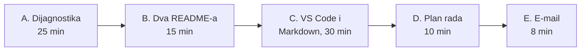
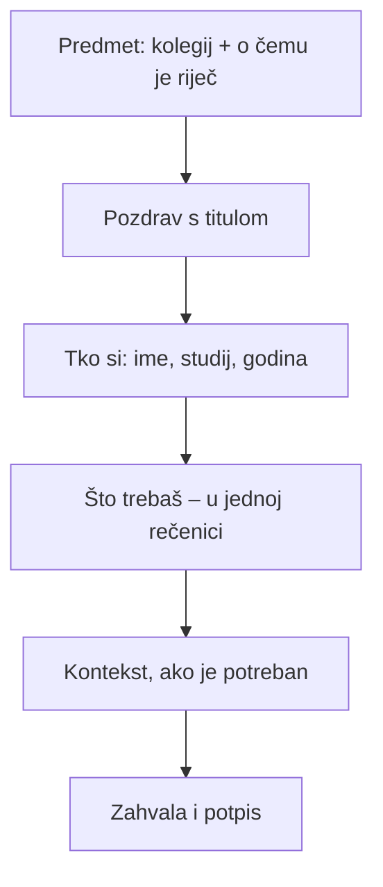

# Vježba 1: Prvi koraci

Danas ćeš napraviti **prvu Markdown datoteku**, **plan rada** za cijeli semestar i **profesionalni e-mail**. Prije toga ispunjavaš kratku ulaznu dijagnostiku.

| | |
|---|---|
| **Trajanje** | 90 minuta |
| **Korištenje AI-a** | Razina 1: danas **bez AI alata** – želimo vidjeti kako pišeš ti |
| **Predaja** | Merlin, zadatak „Vježba 1”, do **14. 10. 2026. u 23:59** |
| **Što predaješ** | `o-meni.md`, `plan-rada.md`, `e-mail.md` |



## A. Ulazna dijagnostika (25 min)

Ispuni obrazac koji ti je podijelio nastavnik. Ne ocjenjuje se.

## B. Koji vam README pomaže? (15 min)

**README** je prva datoteka koju korisnik otvori kad pronađe neki program. Govori mu čemu program služi i kako ga pokrenuti.

Otvori datoteke `README_A.md` i `README_B.md`. Obje opisuju isti alat, **Tjednik**.

> **Napomena:** Tjednik je izmišljeni alat napravljen za ovu vježbu. Ne pokušavaj ga instalirati.

U paru odgovorite:

1. Zamislite da prvi put vidite ovaj alat. S kojim biste README-om **uspjeli** pokrenuti alat?
2. Navedite **tri konkretna mjesta** u slabijem README-u na kojima biste zapeli.
3. Iz toga izvedite **tri pravila** za pisanje dobrog README-a. Svako pravilo u jednoj rečenici.

Pravila skupljamo na ploči. To su vaša prva pravila kvalitete i vraćat ćemo im se cijeli semestar.

## C. Visual Studio Code i prva Markdown datoteka (30 min)

### Što je Markdown?

Markdown je način pisanja običnog teksta s nekoliko oznaka za oblikovanje. `#` znači naslov, `-` stavku popisa, `**tekst**` podebljani tekst. Isti tekst čitljiv je i kao obična datoteka i kao oblikovana stranica. Ovim jezikom pisat ćeš cijelu dokumentaciju u projektu P1.

### Korak 1: Otvori mapu

1. Pokreni **Visual Studio Code**.
    - Na vlastitom računalu, ako ga nemaš: preuzmi ga s <https://code.visualstudio.com>.
    - Ako ne radi: otvori <https://vscode.dev> u pregledniku.
2. U svojoj mapi **Dokumenti** napravi mapu `ATP`.
3. U VS Codeu odaberi **File → Open Folder…** i otvori mapu `ATP`.

**Očekivani rezultat:** u lijevom stupcu (Explorer) vidiš naziv `ATP`.

### Korak 2: Napravi datoteku

1. Odaberi **File → New File…** i upiši naziv `o-meni.md`.
2. Pazi da naziv završava s `.md`. Bez toga VS Code ne zna da je riječ o Markdownu.

**Očekivani rezultat:** datoteka `o-meni.md` pojavi se u lijevom stupcu.

### Korak 3: Prepiši i prilagodi predložak

Prepiši ovaj predložak u svoju datoteku i **zamijeni tekst u uglatim zagradama** svojim podacima. Ne kopiraj ga – pisanjem oznaka rukom brže ih naučiš.

```markdown
# O meni

Ja sam [ime], student/ica prve godine Informacijskih tehnologija.

## Moje računalo

- Operacijski sustav: [Windows 11 / macOS / Linux]
- Uređivač koda: Visual Studio Code
- Najviše radim na: [vlastitom laptopu / računalu u učionici]

## Što već znam

Najviše iskustva imam s **[npr. Pythonom]**, a najmanje s *[npr. terminalom]*.

## Što želim naučiti ovaj semestar

1. [prvi cilj]
2. [drugi cilj]
3. [treći cilj]

## Korisna poveznica

Kolegij pratim na [Merlinu](https://moodle.srce.hr).

Naredba kojom provjeravam verziju Pythona je `python --version`.
```

### Korak 4: Pogledaj kako izgleda

| Radnja | Windows / Linux | macOS |
|---|---|---|
| Pregled u novoj kartici | `Ctrl` + `Shift` + `V` | `Cmd` + `Shift` + `V` |
| Pregled uz tekst | `Ctrl` + `K`, zatim `V` | `Cmd` + `K`, zatim `V` |
| Spremanje | `Ctrl` + `S` | `Cmd` + `S` |

**Očekivani rezultat:** s desne strane vidiš oblikovan tekst s naslovima, popisima i podebljanim riječima.

### Provjera

- [ ] Datoteka se zove `o-meni.md`.
- [ ] Ima jedan naslov `#` i najmanje tri podnaslova `##`.
- [ ] Ima nenumerirani i numerirani popis.
- [ ] Ima barem jednu podebljanu i jednu ukošenu riječ.
- [ ] Ima poveznicu i naredbu označenu kao `kod`.
- [ ] U pregledu nema vidljivih znakova `#`, `*` ni `[`.

## D. Plan rada (10 min)

Kolegij nosi **3 ECTS boda**, što je **75–90 sati rada** u semestru, odnosno oko **5 sati tjedno** zajedno s nastavom. Rokovi ne dolaze iznenada: sve ih vidiš već danas.

1. Napravi datoteku `plan-rada.md`.
2. Prepiši u nju popis rokova. Oznaka `- [ ]` je **popis zadataka**: kad nešto napraviš, upiši `x` između zagrada (`- [x]`).
3. Iste rokove upiši u kalendar na mobitelu, s podsjetnikom **tri dana prije**.

```markdown
# Plan rada: Akademsko i tehničko pisanje

## Rokovi

- [ ] 14. 10. 2026. – Vježba 1 (o-meni.md, plan-rada.md, e-mail.md)
- [ ] 11. 11. 2026. – Dokumentacijski izazov: dnevnik i izvještaj
- [ ] 2. 12. 2026. – P1: prva objava priručnika
- [ ] 10. 12. 2026. – Praktični kolokvij
- [ ] 17. 12. 2026. – P1: konačna verzija i izvještaj o testiranju
- [ ] 6. 1. 2027. – P2: problemsko pitanje, tablica izvora, plan rada
- [ ] 11. 1. 2027. – P2: anotirana bibliografija
- [ ] 17. 1. 2027. – P2: prva cjelovita verzija
- [ ] 21. 1. 2027. – P2: recenzije kolega; prezentacija P1
- [ ] 25. 1. 2027. – P2: konačna verzija
- [ ] 27. 1. 2027. – Završna refleksija

## Moja procjena

Najviše vremena trebat će mi za: [...]

Najveći rizik da zakasnim je: [...]
```

## E. Profesionalni e-mail (8 min)

### Situacija

Na vježbe **22. 10.** ne možeš doći zbog liječničkog pregleda. Javi to nastavniku i pitaj kako nadoknaditi zadatak s tih vježbi.

### Ovako ne

> **Predmet:** (prazno)
>
> bok profesore nemogu doc na vjezbe sljedeci tjedan jel moram nesto nadoknadit
>
> *Poslano s mog iPhonea*

### Što dobar e-mail ima



Napiši svoj e-mail u datoteku `e-mail.md`. **Ne šalji ga** – predaješ ga na Merlin.

### Provjera

- [ ] Iz predmeta se vidi kolegij i o čemu je riječ.
- [ ] U prvoj rečenici nakon pozdrava zna se tko piše.
- [ ] Ono što tražiš stane u jednu rečenicu.
- [ ] Nema skraćenica iz poruka (*jel*, *nemogu*, *pls*).
- [ ] Potpis ima ime, prezime i studij.

## Domaća zadaća (do 14. 10. 2026.)

1. Otvori račun na **GitHubu** (<https://github.com>). Korisničko ime neka bude profesionalno, npr. `ivana-horvat`, ne `xX_gamer_Xx`. Služit će ti cijeli studij.
2. Upiši se u e-kolegij na **Merlinu**.
3. Predaj `o-meni.md`, `plan-rada.md` i `e-mail.md` u zadatak „Vježba 1”.
4. Dodaj u `o-meni.md` poveznicu na svoj GitHub profil.

**Sljedeći tjedan:** jasan tehnički stil i prvi koraci u **terminalu**.
